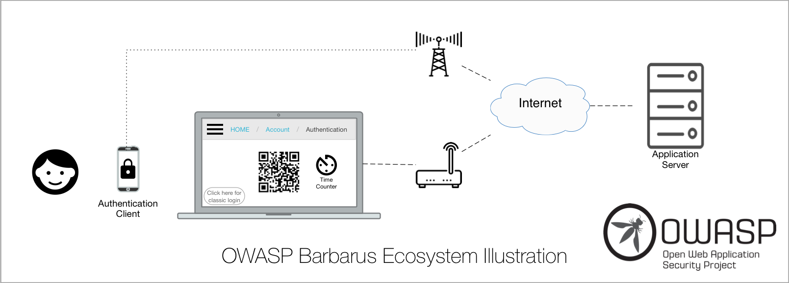
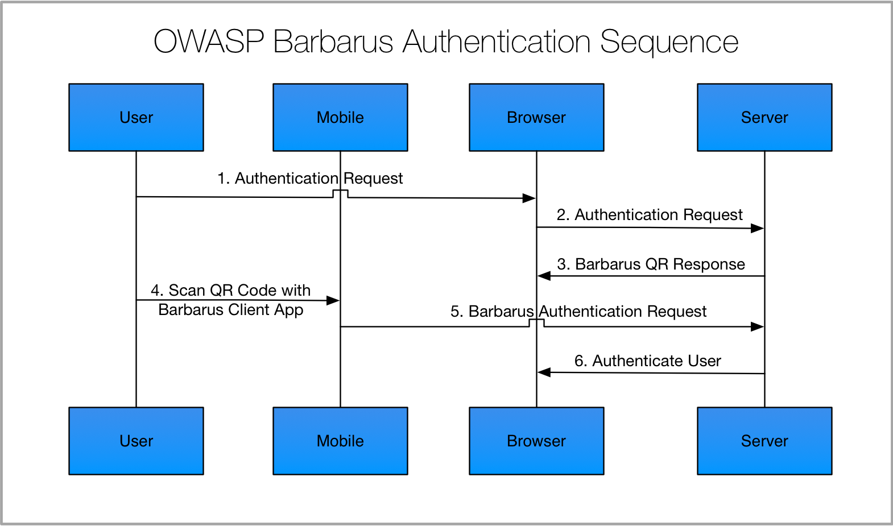
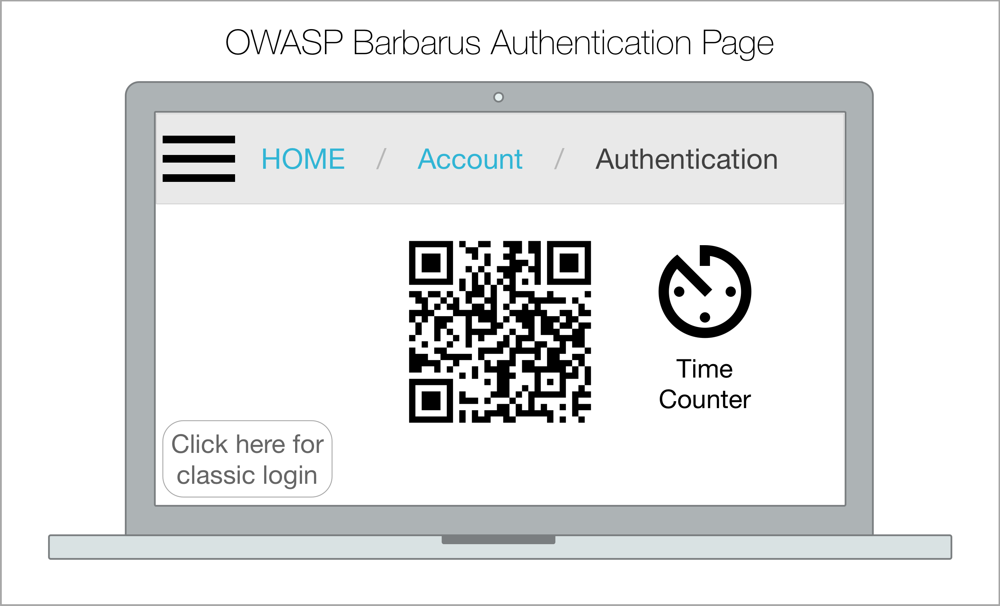

= OWASP Barbarus
Nebrass Lamouchi, OWASP Project Leader & NetBeans Dream Team <lnibrass@gmail.com>

OWASP Barbarus is a secure login authentication solution for Web Applications that offers a secure authentication mechanism through a smartphone.

Barbarus is a project of the Open Web Application Security Project Foundation.

The project was registered as OWASP Project since March 2013. The project cannot progress due to the unmaturity of many technologies and specifications such as the WebSockets, ServerSentEvents, ... 

image::images/owasp-logo.png[width="100%"]

== Why Barbarus?
Barbarus was an Ottoman admiral of the fleet who was born in the island of Lesbos and died in Constantinople,
the Ottoman capital. Barbarus's naval victories secured Ottoman dominance over the Mediterranean during the mid 16th
century, from the Battle of Preveza in 1538 until the Battle of Lepanto in 1571.

OWASP Barbarus will help you avoid many attacks & weaknesses like Keyloggers & password spoofing.

The idea of OWASP Barbarus is to give to a Web Application User the ability to authenticate without typing his
credentials.

The project is a composed of a set of specifications and a reference implementation, which will be our Proof Of Concept.

=== The Basics
* Definition of the Authentication
+
[quote,"Wikipedia","https://en.wikipedia.org/wiki/Authentication"]
Authentication is the act of confirming the truth of an attribute of a single piece of data (a datum) claimed true by
an entity. In contrast with identification, which refers to the act of stating or otherwise indicating a claim
purportedly attesting to a person or thing's identity, authentication is the process of actually confirming that
identity. It might involve confirming the identity of a person by validating their identity documents, verifying the
authenticity of a website with a digital certificate, determining the age of an artifact by carbon dating, or
ensuring that a product is what its packaging and labeling claim to be. In other words, authentication often involves
verifying the validity of at least one form of identification.

==== Authentication Factors and identity
The ways in which someone may be authenticated fall into three categories, based on what are known as the factors of
authentication: something the user knows, something the user has, and something the user is. Each authentication factor
covers a range of elements used to authenticate or verify a person's identity prior to being granted access, approving
a transaction request, signing a document or other work product, granting authority to others, and establishing a
chain of authority.

Security research has determined that for a positive authentication, elements from at least two, and preferably all
three, factors should be verified. The three factors (classes) and some of elements of each factor are:

* *The knowledge factors*:
+
Something the user knows (e.g., a password, Partial Password, pass phrase, or personal
identification number (PIN), challenge response (the user must answer a question, or pattern), Security question

* *The ownership factors*:
+
Something the user has (e.g., wrist band, ID card, security token, cell phone with built-in
hardware token, software token, or cell phone holding a software token)

* *The inherence factors*:
+
Something the user is or does (e.g., fingerprint, retinal pattern, DNA sequence (there are
assorted definitions of what is sufficient), signature, face, voice, unique bio-electric signals, or other biometric
identifier).

==== Types
The most frequent types of authentication available in use for authenticating online users differ in the level of
security provided by combining factors from the one or more of the three categories of factors for authentication:

* *Single-factor authentication*
+
As the weakest level of authentication, only a single component from one of the three categories of factors is used to
authenticate an individual’s identity. The use of only one factor does not offer much protection from misuse or
malicious intrusion. This type of authentication is not recommended for financial or personally relevant transactions
that warrant a higher level of security.

* *Two-factor authentication*
+
When elements representing two factors are required for authentication, the term two-factor authentication is applied
— e.g. a bankcard (something the user has) and a PIN (something the user knows). Business networks may require users
to provide a password (knowledge factor) and a pseudorandom number from a security token (ownership factor).
Access to a very-high-security system might require a mantrap screening of height, weight, facial, and fingerprint
checks (several inherence factor elements) plus a PIN and a day code (knowledge factor elements), but this is still a
two-factor authentication.

* *Multi-factor authentication*
+
Instead of using two factors as used in 2FA, multiple authentication factors are used to enhance security of a
transaction in comparison to the 2FA authentication process.

* *Strong authentication*
+
[quote,"The U.S. government's National Information Assurance Glossary","Strong Authentication Definition"]
layered authentication approach relying on two or more authenticators to establish the identity of an originator or
receiver of information.
+
The European Central Bank (ECB) has defined strong authentication as “a procedure based on two or more of the three
authentication factors”. The factors that are used must be mutually independent and at least one factor must be
“non-reusable and non-replicable”, except in the case of an inherence factor and must also be incapable of being
stolen off the Internet. In the European, as well as in the US-American understanding, strong authentication is very
similar to multi-factor authentication or 2FA, but exceeding those with more rigorous requirements.
+
The Fast IDentity Online (FIDO) Alliance has been striving to establish technical specifications for strong
authentication.

* *Continuous Authentication*
+
Conventional computer systems authenticate users only at the initial log-in session, which can be the cause of a
critical security flaw. To resolve this problem, systems need continuous user authentication methods that continuously
monitor and authenticate users based on some biometric trait(s). A study used behavioural biometrics based in writing
styles as a continuous authentication method.

== The Barbarus Illustration
In this section, we will show the thoery of OWASP Barbarus.

=== The Barbarus Ecosystem

=== Scenario
The execution scenario of the OWASP Barbarus:

==== Step 1
The User visits a protected page on the web application, that is implementing the OWASP Barbarus. When a sign-in is needed, the application redirects the User to the login page.

==== Step 2
The browser notifies the server that a user wants to load the sign-in page. 

==== Step 3
The server generates its response and send it back to the browser. Next, the browser loads the login page, with the grabbed data from the server.

The login page includes the Barbarus QR Code which is the first actor of the authentication scenario.

Example of a typical Barbarus authentication page:

A typical Barbarus authentication page:

* the generated Barbarus QR Code
* the "remaining time" countdown
* the alternative authentication solution: for example a classic authentication link/form

.The generated Barbarus QR Code
The most important element, is the *generated* Barbarus QR Code.

The QR Code contains the ID of the loaded page. Yes! The ID generated by the backend service and attributed for the page that will be loaded.

This ID is the most important element in the Barbarus recipe: this ID will be the identifier of the loaded page, so if the backend service will authenticate the user, it will use this ID to define the destination of its authentication response.

.The "Remaining Time" Countdown
The idea of any 2FA solution, is to give the user a possibility to use many systems (2 or more) in the authentication process. But this ability has to be synchronized or even limited by the time of each attempt.

For example, if you use the 2FA with Google, when grabbing a code from Google Authenticator on your smart phone, you have to type the generated code in less than 30 seconds. After the 30 seconds are elapsed, a new code will be generated, and so on.

In our system, the generated page will be available for *_X seconds_*. We will call X: *_Validity Duration_*.

The *_Validity Duration_*, or the *_X seconds_*, is an implementation choice, which has to be studied with the needs/performance/application type, etc..

NOTE: We recommend that the *_Validity Duration_* value be between *30* and *60 seconds*. It is highly discouraged to choose high values in matter of the application security and performance.

After the *_Validity Duration_* is expired, the login page must redirect the user to a classic login form or must refresh the page to get a new QR code.

.The alternative authentication solution
When choosing to use Barbarus as an authentication solution, remember that OWASP Barbarus was designed to be used mandatory with a smartphone that is using the Barbarus Authentication Client. In case that the user don't hold his smartphone when trying to log to the application, Barbarus will never authenticate the user. So an alternative authentication solution is highly recommended to let users log into the app in case of absence of the smartphone (broken, lost, forgotten anywhere..).

WARNING: We recommend that the application has a basic authentication (Login/Password form) as a backup solution.

==== Step 4
When the QR Code is shown, the user scans it using the Barbarus Client Application.

The Barbarus Client Application tasks:

. Scan & parse the QR Code.
. Send the user credentials, which are pre-filled by the user, with the parsed view ID, to the backend service.
. Manage sessions in many different ways. For example, we can add a functionnality to request session invalidation in the case of the user is away from his authentication position.

==== Step 5
The backend service receives the Client request to authenticate the loaded page for the user. 

First of all, the backend checks the validity of the credentials sent in the request. If the credentials are valid, the service checks if the loaded view is still up (not expired + still active). 

==== Step 6
If everything is ok, the backend authenticates the user, for example, by sending a JWT token to the loaded page, as an authentication response.

We can add also the functionnality of notifying the smartphone application about the authentication event (success/fail) and to give it the ability to invalidate or retry the operation.

